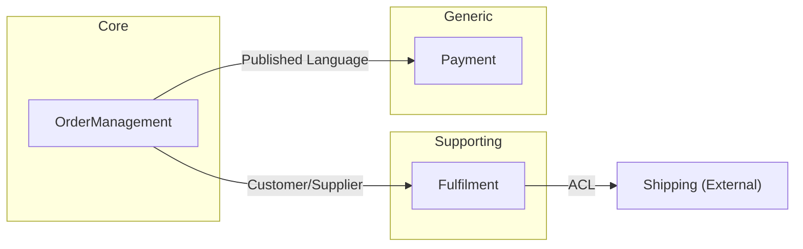
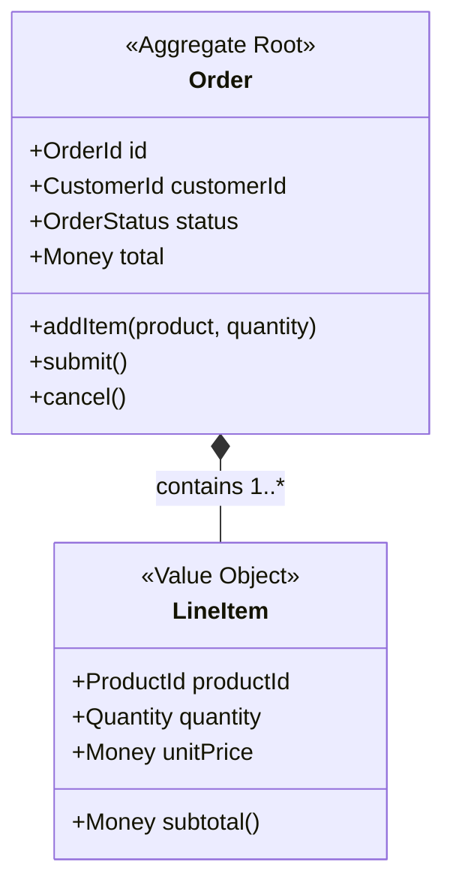
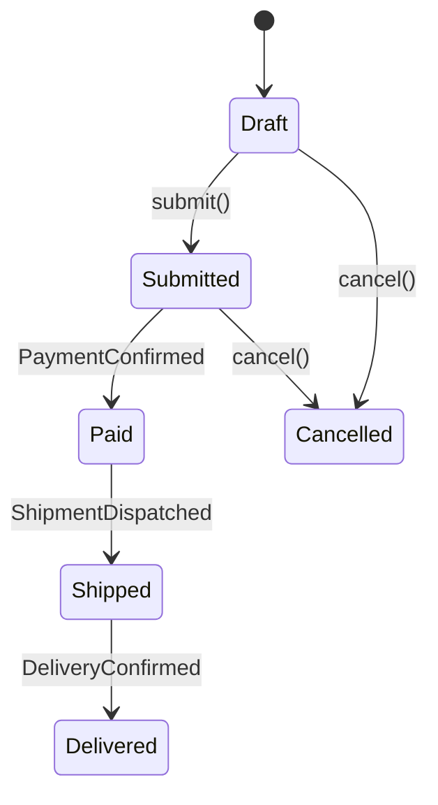
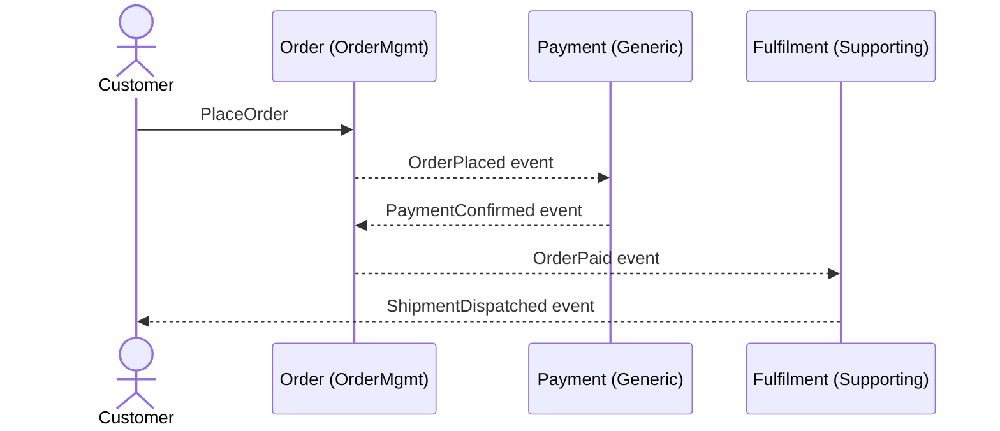

# DDD Modeling

Reference patterns and schemas for the Domain Modeller agent. This skill provides the structured vocabulary for translating validated domain analysis into formal DDD models.

---

## Strategic DDD Patterns

### Bounded Contexts

A Bounded Context is a semantic boundary within which a specific domain model is valid and consistent. Each BC encapsulates its own ubiquitous language, aggregates, and persistence.

**Classification by subdomain type:**

| Type | Description | Investment | Example |
|------|-------------|------------|---------|
| **Core** | Competitive advantage; what makes the business unique | High — custom build, best engineers | Pricing engine, recommendation algorithm |
| **Supporting** | Necessary but not differentiating | Medium — build or customise | Order management, inventory tracking |
| **Generic** | Commodity; same across industries | Low — buy or outsource | Authentication, email sending, payments |

### Context Map Relationship Patterns

| Pattern | Direction | Description | When to Use |
|---------|-----------|-------------|-------------|
| **Shared Kernel** | Bidirectional | Two contexts share a subset of the model | Tightly coupled teams, small shared model |
| **Customer/Supplier** | Upstream → Downstream | Downstream depends on upstream; can negotiate | Different teams, willing to coordinate |
| **Conformist** | Upstream → Downstream | Downstream conforms without negotiation | External system you can't influence |
| **Anticorruption Layer (ACL)** | Downstream shields itself | Translation layer protects downstream model | Legacy integration, external APIs |
| **Open Host Service** | Upstream publishes API | Stable, versioned API for all consumers | Multiple downstream consumers |
| **Published Language** | Upstream defines format | Well-documented interchange format (e.g., OpenAPI, Protobuf) | Cross-team or public APIs |
| **Partnership** | Bidirectional | Two contexts evolve together, mutual dependency | Same team or tightly coordinated teams |
| **Separate Ways** | None | No integration; contexts are independent | Unrelated subdomains |

### Subdomain Discovery Questions

Use these to classify subdomains during Event Storming:
1. "Does this give us competitive advantage?" → Core
2. "Could we buy this off-the-shelf?" → Generic
3. "Is this necessary but not what makes us special?" → Supporting
4. "Would a competitor build this the same way?" → Generic

---

## Tactical DDD Patterns

### Aggregate

A cluster of domain objects treated as a single unit for data changes. Has one **Aggregate Root** (always an Entity) that is the sole entry point for modifications.

**Design rules:**
- Keep aggregates small (prefer single-entity aggregates; expand only when invariants demand it)
- Reference other aggregates by ID only (never embed another aggregate)
- One transaction per aggregate (eventual consistency across aggregates)
- Protect invariants through the root (external code never modifies child entities directly)

### Entity

Has identity (tracked across state changes via an immutable ID). May be mutable. Compared by identity, not attributes.

**Signals that something is an Entity:**
- Has a lifecycle (created, modified, deleted)
- Must be tracked individually (e.g., "this specific order", not "any order with these attributes")
- Identity matters even if all attributes change

### Value Object

Immutable, no identity, compared by attribute values. Always valid at construction.

**Signals that something is a Value Object:**
- Interchangeable — any instance with same attributes is equivalent
- No lifecycle — created and discarded, never updated in place
- Examples: Money, Address, DateRange, Quantity, EmailAddress

### Domain Event

Something significant that happened in the domain. Named in **past tense**. Immutable once published.

**Naming convention:** `<Noun><PastTenseVerb>` — e.g., `OrderPlaced`, `PaymentReceived`, `AddressChanged`

**Structure:**
- Event name (past tense)
- Timestamp
- Aggregate ID that emitted it
- Relevant data snapshot (not the full aggregate — only what consumers need)

### Command

An intent to change the system. Named in **imperative form**. May succeed or fail.

**Naming convention:** `<Verb><Noun>` — e.g., `PlaceOrder`, `CancelOrder`, `ChangeAddress`

**Structure:**
- Command name (imperative)
- Actor (who/what issues it)
- Preconditions (what must be true before execution)
- Postconditions (what must be true after execution)
- Events emitted on success

### Domain Service

Stateless operation that doesn't naturally belong to a single Entity or Value Object. Often coordinates across aggregates.

**When to use:** Business logic that spans multiple aggregates or requires external information not owned by any single aggregate.

---

## Ubiquitous Language

The shared vocabulary used by all stakeholders. Every term in the domain model MUST appear in the glossary. Every entity, value object, event, and command name comes from this glossary.

**Glossary entry format:**

| Field | Required | Description |
|-------|----------|-------------|
| Term | Yes | The canonical name |
| Definition | Yes | One-sentence definition in business language |
| Bounded Context | Yes | Which BC this term belongs to |
| Aliases | No | Alternative names (especially from legacy systems) |
| Anti-terms | No | Terms that are explicitly NOT this (disambiguation) |

**Rules:**
- Same term, different contexts → different definitions are OK (that's the point of BCs)
- No term should appear in the model without a glossary entry
- Glossary is a living document — update as understanding evolves

---

## Event Storming Discovery (LLM-Adapted)

Traditional Event Storming uses sticky notes on a wall. For LLM-driven discovery, the process is conversational:

### Phase 1: Event Discovery (Big Picture)

Ask: "What are the significant things that happen in this domain?"

Produce a chronological timeline of domain events:
```
[Actor] → (Command) → {Aggregate} → [[Event]]
```

### Phase 2: Command Discovery

For each event, ask: "What action or decision caused this event?"

### Phase 3: Aggregate Discovery

Group events and commands that share invariants: "Which events must be consistent together?"

### Phase 4: Bounded Context Discovery

Identify clusters of aggregates that share language: "Where does the same word mean different things?"

### Phase 5: Context Map

Draw relationships between contexts: "How do these contexts communicate?"

---

## Mermaid Templates

### Context Map



### Aggregate Class Diagram



Use `<<Aggregate Root>>`, `<<Entity>>`, `<<Value Object>>` stereotypes to distinguish DDD classifications.

### State Machine



### Event Flow (Sequence Diagram)



---

## Domain Model JSON Schema

The `domain_model.json` schema. All agents producing or consuming domain models MUST conform to this schema.

```json
{
  "metadata": {
    "agent": "domain-modeller",
    "version": "1.0",
    "status": "draft | awaiting_approval | approved | rejected",
    "jira_issue": "string",
    "branch_name": "string",
    "created_at": "ISO 8601",
    "depends_on": ["domain_expert", "tpm"],
    "produces_for": ["implementation_planner", "api_designer", "database_designer"]
  },
  "ubiquitous_language": [
    {
      "term": "string",
      "definition": "string",
      "bounded_context": "string",
      "aliases": ["string"]
    }
  ],
  "bounded_contexts": [
    {
      "name": "string",
      "subdomain_type": "core | supporting | generic",
      "domain_vision": "string",
      "aggregates": [
        {
          "name": "string",
          "root": {
            "name": "string",
            "type": "entity",
            "identity_field": "string",
            "fields": [
              {
                "name": "string",
                "type": "string",
                "classification": "entity | value_object | primitive",
                "cardinality": "1 | 0..1 | 1..* | 0..*"
              }
            ]
          },
          "entities": [
            {
              "name": "string",
              "identity_field": "string",
              "fields": []
            }
          ],
          "value_objects": [
            {
              "name": "string",
              "fields": [
                { "name": "string", "type": "string" }
              ],
              "derived": [
                { "name": "string", "expression": "string" }
              ]
            }
          ],
          "invariants": [
            {
              "id": "INV-N",
              "predicate": "string (logical expression)",
              "description": "string (human-readable)",
              "severity": "critical | warning"
            }
          ],
          "commands": [
            {
              "name": "string (imperative: VerbNoun)",
              "actor": "string",
              "preconditions": ["string (logical expression)"],
              "postconditions": ["string (logical expression)"],
              "emits": ["string (event name)"]
            }
          ],
          "domain_events": [
            {
              "name": "string (past tense: NounVerbed)",
              "fields": [
                { "name": "string", "type": "string" }
              ],
              "triggered_by": "string (command or external event)"
            }
          ],
          "state_machine": {
            "states": ["string"],
            "initial": "string",
            "terminal": ["string"],
            "transitions": [
              {
                "from": "string",
                "to": "string",
                "trigger": "string (command or event name)",
                "guard": "string (predicate) | null"
              }
            ]
          }
        }
      ]
    }
  ],
  "context_map": {
    "relationships": [
      {
        "upstream": "string (BC name)",
        "downstream": "string (BC name)",
        "pattern": "shared_kernel | customer_supplier | conformist | acl | open_host_service | published_language | partnership | separate_ways",
        "implementation": "string (e.g., domain_events, rest_api, grpc, shared_db)"
      }
    ]
  },
  "system_constraints": [
    {
      "name": "string",
      "type": "technical | organisational | external | regulatory",
      "description": "string",
      "impact": "string (what happens if violated)",
      "affected_contexts": ["string (BC names affected)"],
      "mitigation": "string | null"
    }
  ],
  "risks": [
    {
      "description": "string",
      "likelihood": "high | medium | low",
      "impact": "high | medium | low",
      "mitigation": "string",
      "affected_contexts": ["string (BC names affected)"]
    }
  ],
  "system_design_bridge": {
    "service_mapping": [
      {
        "bounded_context": "string",
        "suggested_service": "string",
        "communication": ["sync_api | async_events | grpc | graphql"],
        "data_store_hint": "relational | document | key_value | event_store"
      }
    ]
  },
  "verification": {
    "aggregate_roots_exist": "boolean",
    "value_objects_immutable": "boolean",
    "events_past_tense": "boolean",
    "commands_have_preconditions": "boolean",
    "invariants_have_predicates": "boolean",
    "context_map_symmetric": "boolean",
    "glossary_complete": "boolean",
    "state_machines_complete": "boolean"
  }
}
```

---

## Verification Checklist

The Domain Modeller MUST self-validate against all 8 checks before marking output as complete. Each check corresponds to a field in `verification` in `domain_model.json`.

| # | Check | Rule | How to Verify |
|---|-------|------|---------------|
| V1 | Aggregate roots exist | Every aggregate has exactly one root entity | Count roots per aggregate = 1 |
| V2 | Value objects immutable | No VO has mutation methods; VOs have no identity field | Inspect VO definitions |
| V3 | Events past tense | All domain event names use past tense | Regex: `^[A-Z][a-zA-Z]+(ed|en|lt|nt|wn)$` or manual check |
| V4 | Commands have preconditions | Every command has at least one precondition | Check preconditions array non-empty |
| V5 | Invariants have predicates | Every invariant has a logical predicate, not just prose | Check predicate field is a parseable expression |
| V6 | Context map symmetric | If A is upstream to B, B references A as upstream | Check both directions in relationships |
| V7 | Glossary complete | Every entity, VO, event, and command name appears in ubiquitous_language | Cross-reference model names against glossary terms |
| V8 | State machines complete | No orphan states (every non-initial state is reachable; every non-terminal state has outgoing transitions) | Graph traversal check |

**When a check fails:** Document the failure in `domain_model.md` under a "Verification Issues" section. Do not silently set the flag to `true`.

---

## System Design Bridge

The bridge connects the domain model to technical architecture. It does NOT prescribe implementation — it provides guidance for downstream agents (Implementation Planner, API Designer, Database Designer, Architect).

### BC → Service Mapping Heuristics

| Signal | Mapping |
|--------|---------|
| Core subdomain | Dedicated service; custom implementation |
| Supporting subdomain | Dedicated service or module within larger service |
| Generic subdomain | External service, SaaS, or shared library |
| BC has its own persistence | Separate data store (database-per-service) |
| Two BCs always deployed together | Consider merging into one service |
| BC communicates only via events | Strong candidate for separate service |

### C4 Container Mapping

| DDD Concept | C4 Level |
|-------------|----------|
| System boundary | System Context diagram |
| Bounded Context | Container |
| Aggregate, Domain Service | Component |
| Entity, Value Object, Event | Code |

The system design bridge section of `domain_model.md` provides a **suggested** container mapping. The Architect agent and human validate and refine this.

### Communication Pattern Heuristics

| Context Map Pattern | Suggested Communication |
|-------------------|------------------------|
| Published Language | REST API with OpenAPI / gRPC with Protobuf |
| Customer/Supplier (events) | Async domain events (message broker) |
| ACL | Adapter service or library wrapping external API |
| Shared Kernel | Shared library / shared database schema |
| Partnership | Direct API calls with contract tests |

---

## Anti-Patterns to Avoid

| Anti-Pattern | Problem | Instead |
|-------------|---------|---------|
| **Anemic Domain Model** | Entities with only getters/setters, logic in services | Put behaviour on aggregates; services only for cross-aggregate logic |
| **God Aggregate** | One aggregate that encompasses everything | Split by invariant boundary; keep aggregates small |
| **Phantom Bounded Context** | BC exists in model but has no distinct language | Merge into adjacent BC |
| **Leaking Context** | Terms from one BC used unchanged in another | Define explicit translations or ACL |
| **Event Soup** | Every field change becomes a domain event | Only model events that matter to the business |
| **Premature Splitting** | Splitting BCs before understanding the domain | Start monolithic; split when language diverges |

---

## Downstream Agent Consumption Guide

How downstream agents should read `domain_model.json`:

| Agent | What to Read | How to Use |
|-------|-------------|------------|
| **Implementation Planner** | `bounded_contexts[].aggregates`, `context_map`, `system_constraints`, `risks` | Align work streams to BCs; aggregate = unit of implementation; constraints inform feasibility and risk mitigation |
| **API Designer** | `context_map`, `bounded_contexts[].aggregates[].commands`, `domain_events`, `system_constraints` | API boundaries follow BC boundaries; commands → endpoints; events → async contracts; constraints inform rate limits, auth requirements |
| **Database Designer** | `bounded_contexts[].aggregates`, `invariants`, `state_machine`, `system_constraints` | Aggregate = transactional boundary = table cluster; invariants → constraints; state machine → status enum; system constraints → capacity planning |
| **Architect** | `system_design_bridge`, `context_map`, `system_constraints`, `risks` | C4 containers from service mapping; communication patterns from context map; constraints and risks inform NFRs |
| **SE agents** | `ubiquitous_language`, `system_constraints` | Code naming matches domain terms; entity/VO classification guides struct design; constraints inform error handling |
