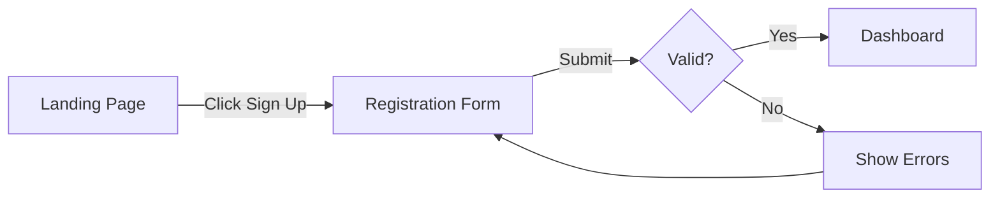

# Figma MCP

Reading design files, extracting design information, creating FigJam diagrams, and bridging design-to-code using the Figma MCP server.

---

## Available Tools

### Design Reading Tools

| Tool | Purpose |
|------|---------|
| `mcp__figma__get_design_context` | **Primary tool** — generate UI code/context from a Figma node |
| `mcp__figma__get_metadata` | Lightweight XML overview (node IDs, types, names, positions, sizes) |
| `mcp__figma__get_variable_defs` | Extract design variables/tokens with resolved values |
| `mcp__figma__get_screenshot` | Capture visual screenshot of a node |
| `mcp__figma__get_figjam` | Read FigJam content with node screenshots (FigJam files only) |

### Design Creation Tools

| Tool | Purpose |
|------|---------|
| `mcp__figma__generate_diagram` | Create flowcharts, state/sequence diagrams, gantt charts in FigJam |
| `mcp__figma__create_design_system_rules` | Generate design system rules file for the repo |

### Code Connect Tools

| Tool | Purpose |
|------|---------|
| `mcp__figma__get_code_connect_map` | Read existing Figma-to-code component mappings |
| `mcp__figma__get_code_connect_suggestions` | Get AI-suggested component mappings |
| `mcp__figma__add_code_connect_map` | Create a single Figma-to-code mapping |
| `mcp__figma__send_code_connect_mappings` | Submit multiple mappings at once |

### Utility

| Tool | Purpose |
|------|---------|
| `mcp__figma__whoami` | Check authenticated user (debug permissions) |

---

## URL Extraction Rules

All tools accepting `fileKey` and `nodeId` follow these rules:

| URL Format | fileKey | nodeId |
|------------|---------|--------|
| `figma.com/design/:fileKey/:fileName?node-id=1-2` | `:fileKey` | `1:2` |
| `figma.com/design/:fileKey/branch/:branchKey/:fileName` | `:branchKey` (NOT fileKey) | from `node-id` param |
| `figma.com/board/:fileKey/:fileName?node-id=1-2` (FigJam) | `:fileKey` | `1:2` |
| `figma.com/make/:makeFileKey/:makeFileName` (Figma Make) | `:makeFileKey` | from context |

Node IDs use colon internally (`123:456`). URLs use dashes (`123-456`). Both formats accepted.

---

## When to Use

**Use for:**
- Extracting design tokens from Figma variables (colours, spacing, typography)
- Understanding existing designs before writing specifications
- Creating user flow diagrams and component state diagrams in FigJam
- Generating design system rules for the repo
- Bridging Figma components to code via Code Connect
- Visual verification — comparing implementation against Figma screenshots

**Do NOT use for:**
- Creating Figma Design files (frames, components, pages) — MCP cannot do this
- Modifying existing designs (editing properties, rearranging layers)
- Calling `get_design_context` on entire pages (too large — use `get_metadata` first)
- Pixel-perfect comparison (use Playwright screenshots for live UI checks)

---

## Usage Patterns

### Pattern 1: Design Understanding

Read an existing Figma file to understand its structure and extract context.

**Sequence:**
1. `get_metadata(fileKey, pageNodeId)` — structural overview with node IDs
2. Identify key frames/components from XML output
3. `get_design_context(fileKey, nodeId)` — detailed context for specific nodes
4. `get_screenshot(fileKey, nodeId)` — visual reference

```
1. get_metadata → sparse XML with node IDs, types, positions, sizes
2. Pick nodes of interest from the XML
3. get_design_context(nodeId) → UI code, layout constraints, token references, asset URLs
4. get_screenshot(nodeId) → visual capture for AI reference
```

> **Tip**: Use `get_metadata` first for large files to avoid token overflow from `get_design_context`.

### Pattern 2: Token Extraction

Extract design tokens from Figma variables and map to W3C format.

**Sequence:**
1. `get_variable_defs(fileKey, nodeId)` — extract variables with resolved values
2. Map colours to W3C `color` tokens
3. Map spacing to W3C `dimension` tokens
4. Cross-reference with existing `design_system.tokens.json` if present

```
1. get_variable_defs → {'colour/primary': '#1a73e8', 'spacing/md': '16px', ...}
2. Map to W3C: { "$type": "color", "$value": "#1a73e8" }
3. Compare against existing tokens — extend, don't replace
```

> See `ui-design` skill for the W3C Design Tokens format specification.

**Known limitations:**
- Returns only default mode values (variable modes/themes not fully supported)
- Aliases may be resolved to final values rather than preserving the alias chain
- Verify resolved values against Figma UI for complex alias chains

### Pattern 3: User Flow Diagrams (FigJam creation)

Create user flow diagrams in FigJam for visual documentation.

**Sequence:**
1. Analyse requirements for user journeys and decision points
2. `generate_diagram(name, mermaidSyntax)` with `flowchart` type
3. Present returned FigJam URL to user as markdown link



**Constraints:**
- Use LR direction by default for flowcharts
- Put ALL shape and edge text in quotes (`["Text"]`, `-->|"Label"|`)
- No emojis in Mermaid code
- No `\n` for newlines
- Colour styling supported sparingly for flowchart only
- **MUST** present returned URL to user as markdown link

### Pattern 4: Component State Diagrams (FigJam creation)

Create state machine diagrams for interactive components.

**Sequence:**
1. Identify interactive components with complex state transitions
2. `generate_diagram(name, mermaidSyntax)` with `stateDiagram-v2` type
3. Present URL to user

```mermaid
stateDiagram-v2
    [*] --> Default
    Default --> Hover : "Mouse Enter"
    Hover --> Active : "Mouse Down"
    Active --> Hover : "Mouse Up"
    Hover --> Default : "Mouse Leave"
    Default --> Focus : "Tab"
    Focus --> Default : "Blur"
    Default --> Disabled : "Set disabled"
    Default --> Loading : "Submit"
    Loading --> Default : "Complete"
    Loading --> Error : "Fail"
    Error --> Default : "Retry"
```

**Supported diagram types:**
- `flowchart` / `graph` — user flows, navigation maps, decision trees
- `stateDiagram-v2` — component states, interaction lifecycles
- `sequenceDiagram` — user-to-UI-to-API interaction flows (no notes allowed)
- `gantt` — implementation timelines, phase planning (no colour styling)

**NOT supported:** class diagrams, timelines, Venn diagrams, ER diagrams.

### Pattern 5: Code Connect Bridge

Map Figma components to codebase components for downstream agents.

**Sequence:**
1. `get_code_connect_map(fileKey, nodeId)` — check existing mappings
2. For unmapped components: `get_code_connect_suggestions(fileKey, nodeId)`
3. Review suggestions, confirm via `send_code_connect_mappings`
4. For manual mapping: `add_code_connect_map(fileKey, nodeId, source, componentName, label)`

```
1. get_code_connect_map → {'1:2': {codeConnectSrc: 'src/components/Button.tsx', codeConnectName: 'Button'}}
2. Identify unmapped components
3. get_code_connect_suggestions → AI-suggested mappings
4. send_code_connect_mappings(mappings) → confirm suggestions
5. add_code_connect_map(nodeId, source, componentName, label) → manual mapping
```

**Requirements:**
- Figma components must be **published to a team library** for Code Connect
- Supported labels: React, Vue, Svelte, Web Components, Storybook, Javascript, SwiftUI, Compose, Flutter, Kotlin, Java, Swift UIKit, Objective-C UIKit, Android XML Layout, Markdown

### Pattern 6: Design System Rules

Generate design system rules that codify conventions for AI agents.

**Sequence:**
1. `create_design_system_rules(clientLanguages, clientFrameworks)`
2. Save generated rules alongside design artifacts
3. Edit to refine project-specific standards

```
1. create_design_system_rules(clientLanguages="typescript", clientFrameworks="react,next")
2. Rules include: token naming, code structure, component templates, framework preferences, asset organisation, icon usage
3. Save to project rules/instructions directory
```

> **Note**: This tool does NOT require a Figma file — it scans the codebase.

---

## Figma-to-W3C Token Mapping

| Figma Concept | W3C Token Type | Notes |
|---------------|---------------|-------|
| Colour variable | `color` | Map fill colours, not stroke |
| Text variable | `typography` | Includes family, size, weight, line height |
| Effect style (shadow) | `shadow` | Map drop shadows, not inner shadows |
| Corner radius | `dimension` | Extract from component frames |
| Spacing (auto-layout) | `dimension` | Extract gap and padding from auto-layout frames |

---

## Anti-Patterns

| Anti-Pattern | Problem | Instead |
|--------------|---------|---------|
| Calling `get_design_context` on entire pages | Too large, token overflow | Use `get_metadata` first to identify nodes |
| Ignoring `get_variable_defs` alias resolution | Aliases resolved to final values | Verify against Figma UI for complex chains |
| Not presenting `generate_diagram` URLs to user | User cannot access the created diagram | **MUST** show URL as markdown link |
| Treating Figma as source of truth for code | Figma changes without spec updates | The design spec (`design.md`) is the contract |
| Using non-existent tool names | Tools like `get_file`, `get_file_styles`, `get_component` do not exist | Use the tools documented in this skill |
| Exporting entire file at once | Too large, slow, high token usage | Target specific nodes by ID |

---

## Rate Limits

| Plan | Daily Limit | Per-Minute |
|------|-------------|------------|
| Enterprise (Full/Dev) | 600 calls/day | 20/min |
| Organisation (Full/Dev) | 200 calls/day | 15/min |
| Professional (Full/Dev) | 200 calls/day | 10/min |
| Starter or View/Collab | 6 calls/month | N/A |

---

## Graceful Degradation

If `mcp__figma` is not available (not configured, no API token, or connection error):
- **Skip** Figma-based extraction and diagram creation
- **Work from** existing `design.md` specs, `design_system.tokens.json`, CSS/theme files, or user descriptions
- **Note** in output: "Figma MCP not available — working from existing specs and codebase"
- **Do not** block on MCP availability
